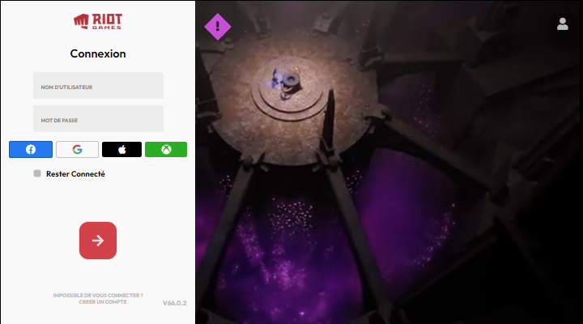

    

<h1 align="center">Page de Connexion League Of Legend</h1>

    <a href="#Information">A propos de</a> • 
    <a href="#Langages">Outils</a> • 
    <a href="#Auteur">Auteur</a> 

-https://forthebadge.com/images/badges/made-with-javascript.svg

### Information

Une réplique de l'écran d'authentification du jeu league of legends via HTML & CSS & JS & UNPKG (NPM).

### Langages

Les outils suivants 🛠 ont été utilisés dans la construction du projet :

<table>
    <tr>
        <td><a href="https://html.com/">HTML</a></td>
        <td><a href="https://www.w3schools.com/css/">CSS</a></td>
        <td><a href="https://www.javascript.com/">JS</a></td>
        <td><a href="https://unpkg.com/">UNPKG</a></td>
    </tr>
    <tr>
        <td>5.2</td>
        <td>2.1</td>
        <td>1.0</td>
        <td>16.7.0</td>
    </tr>
</table>

### Auteur

> Crée par NotBB 👉• GitHub [@NotBB7](https://github.com/NotBB7)
